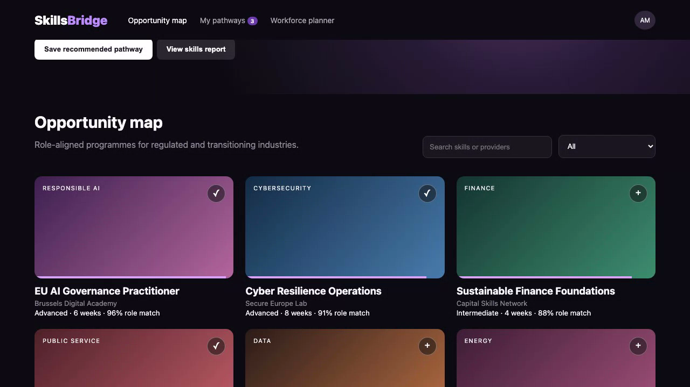

# SkillsBridge EU

SkillsBridge helps people and organisations find useful learning programmes for changing jobs and new skills.

## Live demo

[Watch the recorded product demonstration](docs/demo.webm)

This recording shows the real product running and demonstrates its main screens and actions.

## Screenshots



## Main features

- Search for learning programmes.
- Filter programmes by subject.
- See how well a programme matches a role.
- Save a personal learning path.
- Check learning progress.
- Create a learning group for a team.

## Technology used

- Vue 3 with TypeScript.
- Vite for local development and production builds.
- Java with Spring Boot for the backend.
- Maven for Java builds.
- Vitest and JUnit for automated checks.

## Installation instructions

You need Node.js 20 or newer, Java 21 or newer, and Maven 3.9 or newer.

Install the frontend packages:

```bash
npm ci
```

Run all automated checks and production builds:

```bash
npm test
npm run build
npm run backend:test
npm run backend:build
```

Start the frontend and Java backend together:

```bash
npm run fullstack
```

Open [http://localhost:5173](http://localhost:5173) for the product. The Java API runs at [http://localhost:8080](http://localhost:8080).

## Commercial licensing/contact

No commercial license is granted automatically. For commercial licensing, integration work, consulting, or partnership enquiries, contact [Amitesh2022 through GitHub](https://github.com/Amitesh2022).
